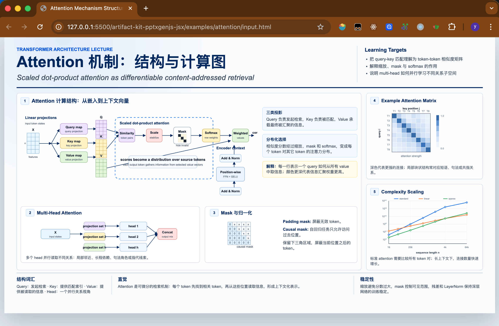
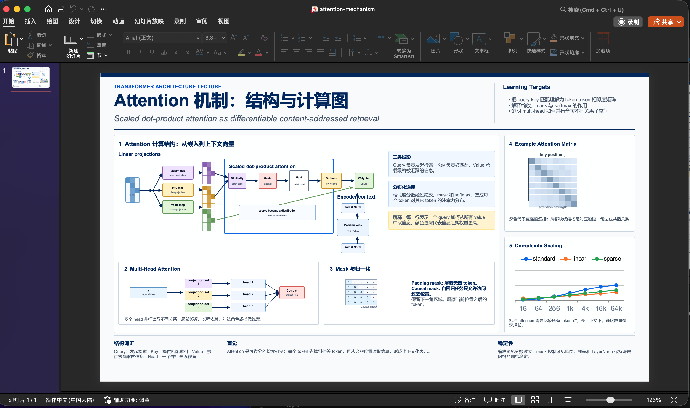
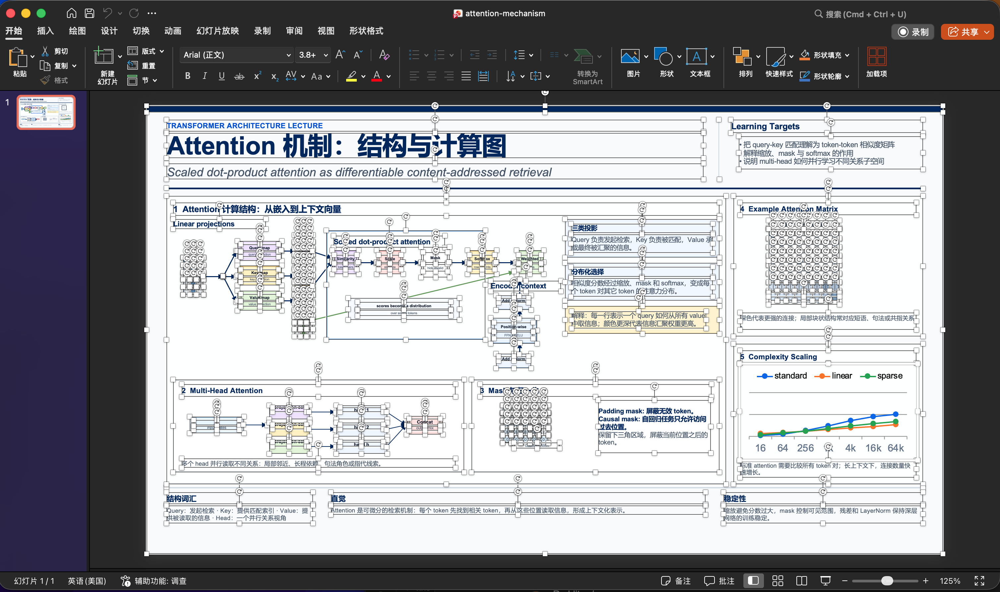

# HTML to PPTX Skill

Teach an agent to turn HTML pages into downloadable, editable PowerPoint decks with [`@artifact-kit/pptxgenjs-jsx`](https://github.com/artifact-kit/pptxgenjs-jsx).

Repository: [`artifact-kit/html-to-pptx-skill`](https://github.com/artifact-kit/html-to-pptx-skill)

This skill uses a browser exporter workflow: keep the source HTML clean, copy it into an exporter page, flatten every slide/page into a top-to-bottom container, add DOM measurement markers to the exporter, and generate native PPTX objects from measured boxes plus SVG source geometry.

## What It Does

- Converts web pages, dashboards, reports, or slide-like HTML into `.pptx`.
- Preserves editability with native PowerPoint text, shapes, lines, tables, images, and charts.
- Uses `data-ak-measure` and `readPptBox()` so agents do not guess DOM coordinates.
- Maps SVG primitives from `viewBox` coordinates into editable PPT shapes.
- Uses raster fallback only when native reconstruction is not practical.
- Includes vendored component/props docs so agents can use the JSX wrapper without guessing.

## Install As A Skill

For Codex-style agents, clone this repository into the skills directory. Use the folder name `html-to-pptx-jsx` so the installed skill name stays stable:

```bash
mkdir -p ~/.codex/skills
git clone https://github.com/artifact-kit/html-to-pptx-skill.git ~/.codex/skills/html-to-pptx-jsx
```

For other LLM/agent runtimes, install this repository as a folder that contains `SKILL.md`, then configure the runtime to load that folder as a skill/tool instruction source.

Agent installation instruction:

```text
Install the HTML to PPTX skill from https://github.com/artifact-kit/html-to-pptx-skill.
Clone it into your skill directory, then load SKILL.md when the user asks to convert HTML,
dashboards, reports, slide-like pages, or SVG-heavy pages into editable PowerPoint decks.
After loading the skill, follow its copy-first browser exporter workflow: copy the source,
flatten slides vertically, use the CDN browser library, measure DOM nodes, then export.
```

To update an existing install:

```bash
cd ~/.codex/skills/html-to-pptx-jsx
git pull
```

## Runtime Pattern

Generated exporters use the published browser IIFE before Babel:

```html
<script src="https://unpkg.com/@artifact-kit/pptxgenjs-jsx/dist/pptxgenjs-jsx.browser.iife.js"></script>
<script src="https://unpkg.com/@babel/standalone/babel.min.js"></script>
```

Inside the inline Babel module:

```tsx
/** @jsx pptxElement */
const {
  Deck,
  Slide,
  Text,
  measureArtifacts,
  pptxElement,
  readPptBox,
  readSlideLayout,
  renderPptx,
  validateDeck,
} = window.ArtifactKitPptxGenJsx;
```

## Example

This repo includes a concrete measure-first demo:

- Clean input: [`examples/input/attention-mechanism.html`](examples/input/attention-mechanism.html)
- Generated exporter: [`examples/generated/attention-pptx-export.html`](examples/generated/attention-pptx-export.html)

Run it locally:

```bash
cd html-to-pptx-skill
python3 -m http.server 4178
```

Open:

```text
http://127.0.0.1:4178/examples/generated/attention-pptx-export.html
```

Click **Export PPTX**. The exporter measures its own DOM, recreates the slide with native PowerPoint objects, validates the deck, and downloads a `.pptx`.

## Proven Output

The attention example is included as a concrete proof of the workflow:

1. Start from a clean HTML slide. The source page remains a normal browser document, without measure attributes baked into the input.



2. Export to a `.pptx` that visually tracks the HTML layout using measured DOM boxes, SVG primitive mapping, native chart data, and native PowerPoint shapes.



3. Open the generated deck and select the content. Text, cards, grid cells, lines, arrows, charts, and diagram parts are editable PowerPoint objects instead of one flattened screenshot.



## Agent Workflow

1. Read `SKILL.md`.
2. Copy the source HTML into a separate exporter file; do not edit the source.
3. Flatten all slides/pages into one visible vertical container in the exporter copy.
4. Add one export button and load the CDN browser build plus Babel Standalone.
5. Add `data-ak-*` measurement attributes to slide roots and reusable DOM nodes.
6. In the export click handler, call `measureArtifacts`, read boxes/fonts/layouts, recreate each slide with documented JSX components and props, validate, then export.
7. Read `examples/generated/attention-pptx-export.html`, `assets/browser-inline-jsx-template.html`, and the component/props docs named in `SKILL.md` before coding.
8. Before handoff, run through `references/audit-checklist.md`.

## Design Positioning

This is not a screenshot pipeline. It is a production-flow bridge for agents:

- HTML provides the visual and content reference.
- DOM measurement provides reliable layout.
- SVG source provides precise primitive geometry.
- JSX provides a structured PowerPoint declaration language.
- `@artifact-kit/pptxgenjs-jsx` exposes PptxGenJS through LLM-friendly components.
